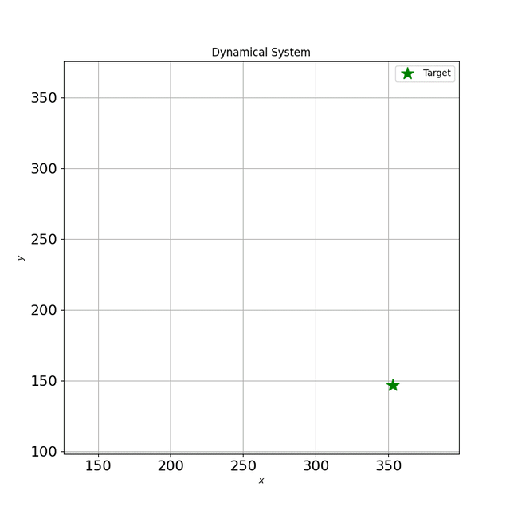

# Deep Metric Imitation Learning for Stable Motion Primitives
[](https://opensource.org/licenses/MIT)

Code accompanying the paper: "Deep Metric Imitation Learning for Stable Motion Primitives" accepted at Advanced Intelligent Systems.
For details, please refer to [paper](https://arxiv.org/pdf/2310.12831.pdf).

## Teaser: Non-Euclidean and second-order learned motions
<div align="center">
    
    
</div>

## Installation

You can install the package using pip.
```bash
pip install -r requirements.txt
```

## Usage
In the folder `src` run:

### Training
```bash
  python train.py --params <params_file_name>
```
The parameter files required for the argument `params_file_name` can be found in the folder `params`.

### Simulate learned 2D motion
```bash
  python simulate_ds.py
```

### Hyperparameter Optimization
```bash
  python run_optuna.py --params <params_file_name>
```

## Troubleshooting

If you run into problems of any kind, don't hesitate to [open an issue](https://github.com/rperezdattari/PUMA-Deep-Metric-IL-for-Stable-Motion-Primitives/issues) on this repository.
